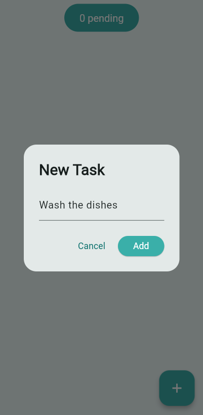

# Minty Todo App 🍃

A clean, minimalist Flutter todo app with a mint-themed UI and smooth interactions.  
Tasks are displayed in rounded pill-style rows with switches, swipe-to-delete, and a lightweight dialog for adding new items.

---

## 📷 Screenshots

### Add New Task Dialog

### Main Home Page

---

## 🚀 Features

- Add tasks using a modal dialog
- Toggle task completion with a switch
- Swipe to delete task items
- Animated pill-style task tiles
- Clean color palette with soft shadows
- Persistent task list in memory

---

## 📁 Folder Structure

